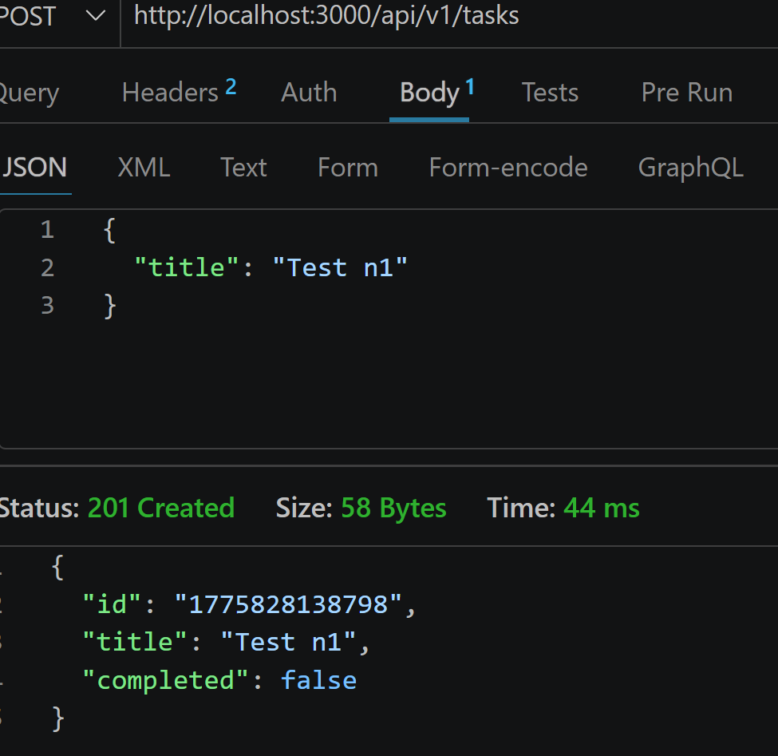
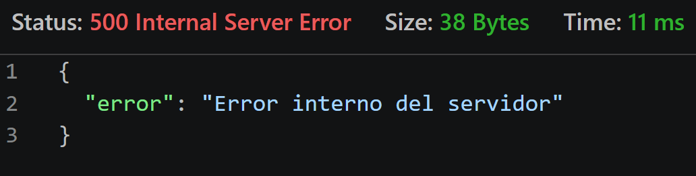
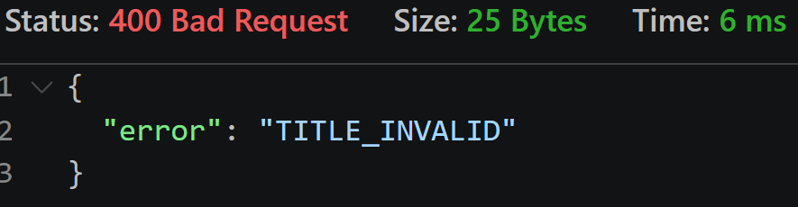
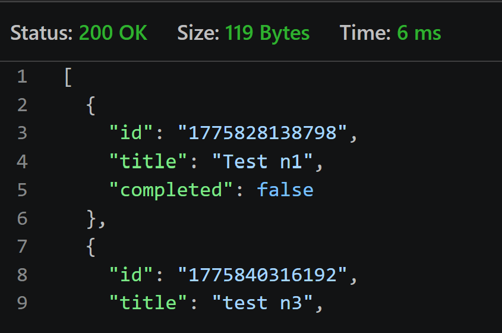
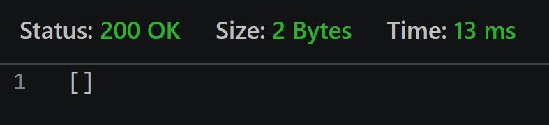
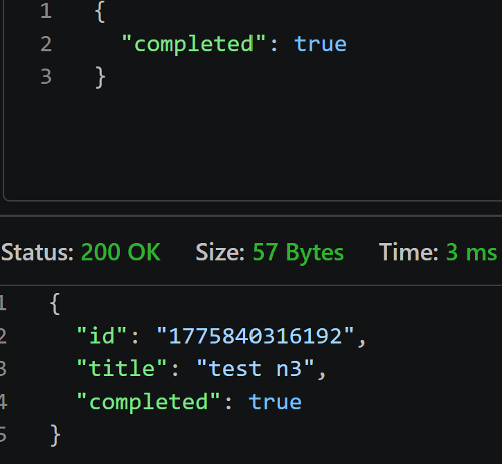
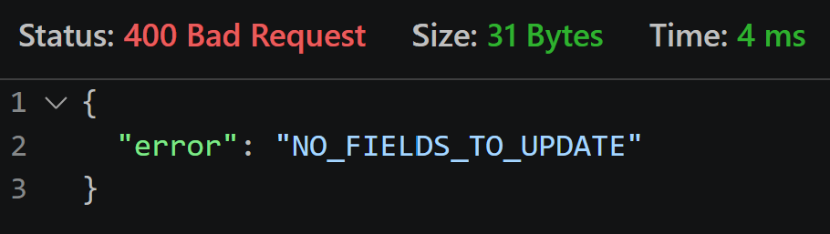
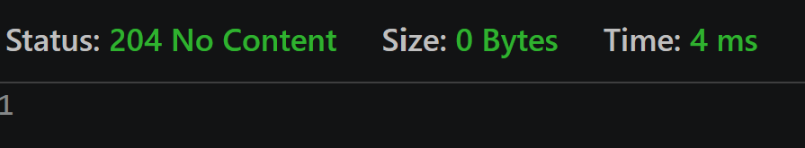
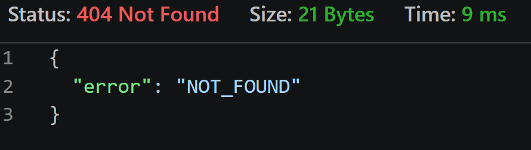

# Pruebas con Thunder Client (Servidor local)

## EndPoints

### POST

**Creacion de tareas**

1. 

**Creacion de tarea sin body**

2. 

**Creacion de tarea sin titulo**

3. 2. 

### GET

**Obtencion de todas las tareas**

1. 

**Obtencion de tareas no existentes**

2. 

### PUT

**Modificacion de tarea**

1. 

**Sin Body**

2. 

### DELETE

**Eliminacion de tareas**

1. 

**Eliminacion de tarea (No la ha encontrado)**

2. 

